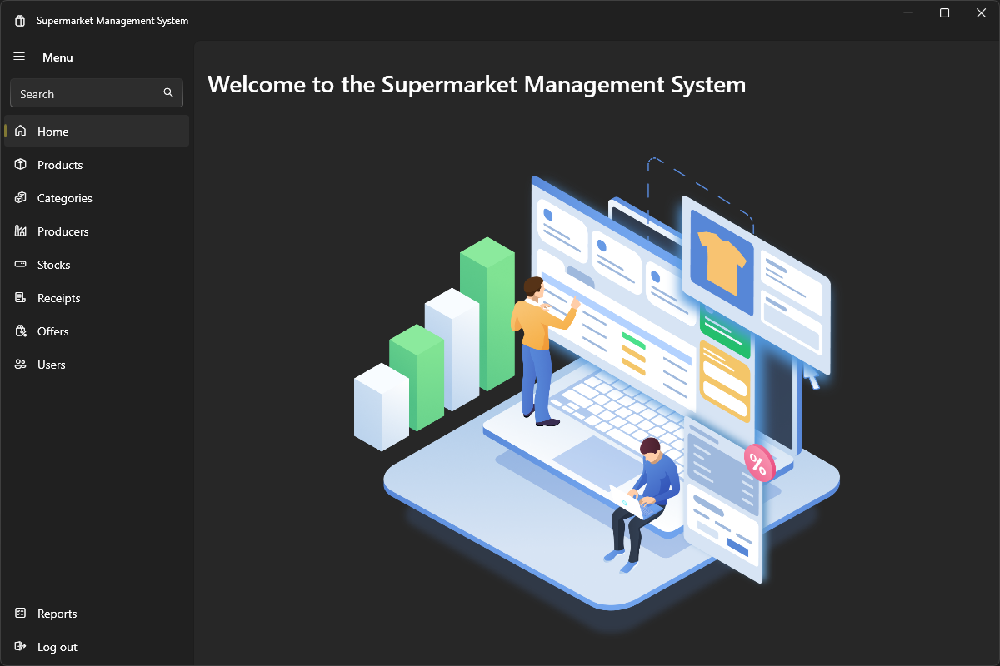
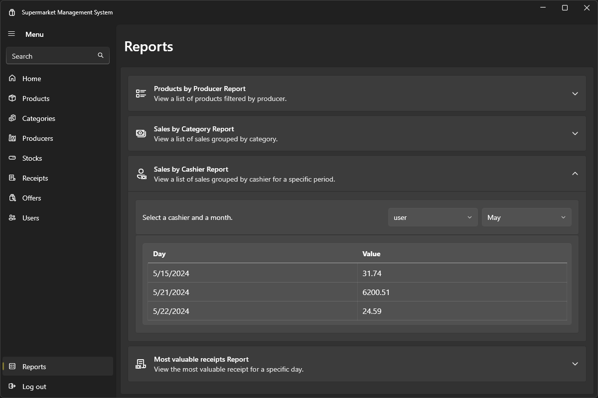

# Supermarket Management Application

<div style="display: flex; justify-content: center;">
    
</div>

## Project Overview
The Supermarket Management Application is a comprehensive software solution designed to manage various aspects of a supermarket's operations. Developed using C#, WPF, and SQL Server, this application follows the MVVM (Model-View-ViewModel) architectural pattern to ensure a clean separation between the UI and business logic. The application features functionalities for handling products, producers, product categories, stock management, user roles, sales receipts, and promotional offers.

## Table of Contents
- [Features](#features)
- [Prerequisites](#prerequisites)
- [Installation](#installation)
- [Database Setup](#database-setup)
- [Usage](#usage)
- [Screenshots](#screenshots)
- [Development Details](#development-details)
- [Contributing](#contributing)
- [License](#license)
- [Acknowledgements](#acknowledgements)

## Features
### For Administrators
- **User Management:** Add, modify, delete (logical deletion), and view users.
- **Product Management:** Add, modify, delete (logical deletion), and view products.
- **Producer Management:** Add, modify, delete (logical deletion), and view producers.
- **Category Management:** Add, modify, delete (logical deletion), and view product categories.
- **Stock Management:** Add, modify, delete (logical deletion), and view stock details. Automatically calculate selling price based on purchase price and commercial markup.
- **Reports and Queries:**
  - List products by selected producer and category.
  - Display total value per product category based on current selling prices.
  - View daily earnings for a selected user in a specific month.
  - Show the largest receipt of the day.
- **Promotional Offers Management:** Create and manage offers based on product expiration or stock liquidation.

### For Cashiers
- **Product Search:** Search products by name, barcode, expiration date, producer, or category.
- **Receipt Management:** Create and view receipts with automatic price calculations and totals. Once confirmed, receipts cannot be modified.
- **Stock Updates:** Automatically update stock quantities based on sales. Stock becomes inactive when depleted or expired.

## Prerequisites
- .NET 8 SDK
- SQL Server
- EntityFrameworkCore
- WPF-UI NuGet Package

## Installation
1. **Clone the repository:**
    ```sh
    git clone https://github.com/ccaesar26/Tema3_Supermarket.git
    cd supermarket-management-app
    ```
2. **Set up the database:**
    - Create a new SQL Server database.
    - Update the connection string in `appsettings.json` to point to your database.
    - Run the database migrations to create the necessary tables:
      ```sh
      dotnet ef database update
      ```

3. **Install dependencies:**
    ```sh
    dotnet restore
    ```

4. **Build and run the application:**
    ```sh
    dotnet build
    dotnet run
    ```

## Database Setup
1. **Create a new SQL Server database.**
2. **Update the connection string in `appsettings.json` to point to your database.**
3. **Run the provided `GenerateDatabase.sql` script to set up the database schema, initial data, and stored procedures:**
    - Open SQL Server Management Studio (SSMS) or your preferred SQL client.
    - Connect to your SQL Server instance.
    - Open and execute the `GenerateDatabase.sql` script file located in the root of the project directory.

4. **Run the database migrations to ensure the latest schema updates:**
    ```sh
    dotnet ef database update
    ```

## Usage
### Administrator
1. **Login as an administrator.**
2. **Navigate to the relevant sections to manage users, products, producers, categories, and stocks.**
3. **Use the reporting tools to view detailed information about stock levels, product values, and user earnings.**

### Cashier
1. **Login as a cashier.**
2. **Search for products to add to the sales receipt.**
3. **Complete the sale to generate and save the receipt.**

## Screenshots

### Administrator
<div style="display: flex; justify-content: center;">
    
    
    
    
    
    
</div>

### Cashier
<div style="display: flex; justify-content: center;">
    
    
    
</div>

## Development Details

The Supermarket Management Application was developed using the following technologies and design principles:

- **C# and WPF:** The application is built with C# and Windows Presentation Foundation (WPF) for a robust and visually appealing user interface.
- **MVVM Architecture:** Adopting the Model-View-ViewModel (MVVM) pattern ensures a clean separation between the user interface and business logic, facilitating easier maintenance and testing.
- **Entity Framework Core:** Used as the Object-Relational Mapper (ORM) to interact with the SQL Server database, allowing for efficient data management and migration handling.
- **Data Binding:** Extensively used WPF data binding to synchronize the UI with underlying data models, enabling dynamic and real-time updates to the interface.
- **Validation and Error Handling:** Implemented validation rules and error handling mechanisms to ensure data integrity and provide meaningful feedback to users.

The development process followed agile methodologies, incorporating iterative development, continuous integration, and regular code reviews to maintain high code quality and adaptability to changing requirements.

## Contributing
We welcome contributions to enhance the Supermarket Management Application. If you have suggestions, bug reports, or pull requests, please follow these steps:
1. Fork the repository.
2. Create a new branch for your feature or bugfix.
3. Commit your changes and push to your fork.
4. Submit a pull request with a detailed description of your changes.

## License
This project is not licensed and comes with no warranty or guarantee of any kind. You are free to view and fork the code for personal and educational purposes.

## Acknowledgements
- Thanks to the developers and the community for their contributions and feedback.
- Special thanks to the creators of [WPF-UI](https://github.com/lepoco) and EntityFrameworkCore for their powerful tools and frameworks.
